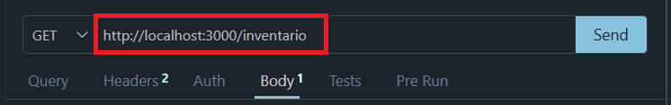

# Atividade Aula 05

Atividade desafiadora proposta na aula 05 de Programação Back-Ending (PBE).

## Descrição

Este projeto consiste em código CRUD com busca por ID, para um sistema de gerenciamento de patrimônios de uma empresa.
## Tecnologias Utilizadas

- Node.js;
- JSON;
- VSCode;
- Express.

## Instruções para Instalação e Execução
### Passo a Passo

1. Clone o repositório dentro da máquina e abra o VSCode nela.
2. Com o terminal do VSCode, instale as dependências executando:
   ```bash
   npm install express
   ```
3. Inicie o servidor:
   ```bash
   node server.js
   ```
4. O servidor estará acessível na URL: `http://localhost:3000/inventario`
5. Teste no `Thunder Client`. 

## Lista das Rotas Disponíveis

| Método HTTP | Rota | Descrição |
| :--- | :--- | :--- |
| `GET` | `/inventario` | Listagem de todos os itens no mockup. |
| `GET` | `/inventario/id_teste` | Busca no mockup o item que tem o id mostrado no espaço `id_teste`. |
| `POST` | `/inventario` | Adiciona um novo item ao mockup. |
| `PUT` | `/inventario/id_teste` | Atualiza o item a partir do id mostrado no espaço `id_teste`, com as informações para trocá-lo no `body` |
| `DELETE` | `/inventario/id_teste` | Remove o item do mockup a partir do id mostrado em `id_teste`. |

}

## Exemplos de Requisição e Resposta

1. 
